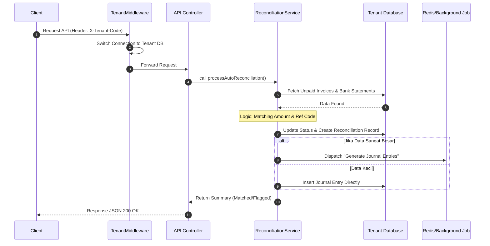
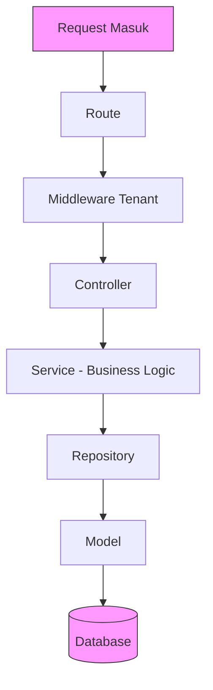

# Dokumentasi Arsitektur API & Rekonsiliasi

Dokumen ini mendefinisikan standar komunikasi antar komponen dan pola desain kode agar logika bisnis tetap bersih, modular, dan mudah diuji.

---

## 1. Sequence Diagram: Proses Rekonsiliasi (Sistem Multi-DB)

Diagram ini menggambarkan bagaimana sebuah request rekonsiliasi diproses dari mulai identifikasi tenant hingga eksekusi asinkron.



## 2. Arsitektur Layering: Pemisahan Tanggung Jawab

Pemisahan kode ke dalam beberapa layer bertujuan untuk mencapai *Separation of Concerns*. Hal ini memastikan bahwa perubahan di satu bagian (misalnya perubahan database) tidak akan merusak bagian lain (seperti logika bisnis). Ini adalah standar profesional untuk membangun sistem yang mudah dipelihara (*maintainable*) dan diuji (*testable*).

### Mengapa Layer ini Ada?

| Layer | Tanggung Jawab | Manfaat |
|-------|----------------|---------|
| **Route & Middleware** | Filter pertama, memastikan request masuk ke koneksi database tenant yang benar | Keamanan & isolasi data antar perusahaan |
| **Controller** | Pengatur lalu lintas, meneruskan request ke service yang tepat | Memisahkan logika HTTP dari bisnis logic |
| **Service** | Jantung aplikasi, berisi semua aturan bisnis ERP | Mudah diuji, logic terpusat |
| **Repository (Opsional)** | Mengisolasi query database | Fleksibel terhadap perubahan database |
| **Model** | Representasi data dan interaksi dengan database | Konsistensi struktur data |

### Dimana Caching & Background Process Bekerja?

| Layer | Peran dalam Caching & Background Process |
|-------|------------------------------------------|
| **Controller** | Menerima request, langsung mengembalikan response 202 Accepted dengan job_id |
| **Service** | Memutuskan apakah suatu proses perlu di-queue atau bisa langsung dieksekusi |
| **Queue/Job Layer** | Layer baru yang menangani proses berat di background |
| **Cache Layer** | Layer baru antara Service dan Database untuk menyimpan hasil agregasi |

### Alur Data Antar Layer



### Prinsip yang Harus Dipegang

1. **Controller tidak boleh berisi logic bisnis** - hanya memanggil service
2. **Service tidak boleh tahu tentang HTTP request/response** - hanya menerima data
3. **Repository tidak boleh berisi logic bisnis** - hanya query database
4. **Model hanya untuk representasi data** - tidak boleh berisi logic bisnis kompleks
5. **Setiap layer hanya bicara dengan layer di bawahnya** - jangan lompat-lompat

## 3. Contoh Implementasi Kode (Laravel)

### A. Model Layer (Data Contract & Type Safety)

Model digunakan untuk mendefinisikan struktur data dan interaksi dengan database. Kita juga bisa menggunakan Form Request untuk validasi.

**app/Models/Invoice.php**
```php
<?php

namespace App\Models;

use Illuminate\Database\Eloquent\Model;

class Invoice extends Model
{
    protected $table = 'invoices';

    protected $fillable = ['invoice_number', 'total_amount', 'status'];

    protected $casts = [
        'total_amount' => 'decimal:2',
    ];
}
```

**app/Http/Requests/ReconciliationRequest.php**
```php
<?php

namespace App\Http\Requests;

use Illuminate\Foundation\Http\FormRequest;

class ReconciliationRequest extends FormRequest
{
    public function authorize(): bool
    {
        return true;
    }

    public function rules(): array
    {
        return [
            'amount' => 'required|numeric|min:0.01',
            'refCode' => 'required|string|max:50',
            'bankId' => 'required|string|max:50',
        ];
    }

    public function messages(): array
    {
        return [
            'amount.min' => 'Nominal harus positif',
        ];
    }
}
```

**app/DTO/ApiResponse.php**
```php
<?php

namespace App\DTO;

class ApiResponse
{
    public string $status;
    public $data;
    public string $message;

    public function __construct(string $status, $data = null, string $message = "")
    {
        $this->status = $status;
        $this->data = $data;
        $this->message = $message;
    }

    public function toArray(): array
    {
        return [
            'status' => $this->status,
            'data' => $this->data,
            'message' => $this->message,
        ];
    }
}
```

### B. Route & Middleware Layer (Tenant Switcher)

**routes/api.php**
```php
<?php

use Illuminate\Support\Facades\Route;
use App\Http\Controllers\ReconciliationController;

Route::post('/reconcile', [ReconciliationController::class, 'process'])
    ->middleware('tenant.database');
```

**app/Http/Middleware/TenantDatabaseMiddleware.php**
```php
<?php

namespace App\Http\Middleware;

use Closure;
use Illuminate\Http\Request;
use App\Services\TenantManager;
use Symfony\Component\HttpFoundation\Response;

class TenantDatabaseMiddleware
{
    public function __construct(protected TenantManager $tenantManager) {}

    public function handle(Request $request, Closure $next): Response
    {
        $tenantCode = $request->header('X-Tenant-Code');

        if (!$tenantCode) {
            return response()->json(['error' => 'Kode tenant tidak ditemukan'], 400);
        }

        try {
            $this->tenantManager->setConnection($tenantCode);
        } catch (\Exception $e) {
            return response()->json(['error' => 'Koneksi database tenant gagal: ' . $e->getMessage()], 500);
        }

        return $next($request);
    }
}
```

### C. Controller Layer (The Orchestrator)

**app/Http/Controllers/ReconciliationController.php**
```php
<?php

namespace App\Http\Controllers;

use App\Http\Requests\ReconciliationRequest;
use App\Services\ReconciliationService;
use App\DTO\ApiResponse;
use Exception;

class ReconciliationController extends Controller
{
    public function __construct(protected ReconciliationService $reconciliationService) {}

    public function process(ReconciliationRequest $request)
    {
        try {
            $validatedData = $request->validated();
            $result = $this->reconciliationService->handle($validatedData);
            return response()->json(new ApiResponse("success", $result));
        } catch (Exception $e) {
            return response()->json(new ApiResponse("error", null, $e->getMessage()), 400);
        }
    }
}
```

### D. Service Layer (Business Logic)

**app/Services/ReconciliationService.php**
```php
<?php

namespace App\Services;

use App\Repositories\InvoiceRepository;
use Exception;

class ReconciliationService
{
    public function __construct(protected InvoiceRepository $invoiceRepo) {}

    public function handle(array $data): array
    {
        $invoice = $this->invoiceRepo->findByReference($data['refCode']);

        if (!$invoice) {
            throw new Exception("Referensi tidak ditemukan");
        }

        if ((float) $invoice->total_amount !== (float) $data['amount']) {
            throw new Exception("Nominal tidak cocok");
        }

        $reconciliation = $this->invoiceRepo->markAsPaid($invoice->id, $data['bankId']);

        return [
            'invoice_id' => $invoice->id,
            'status' => 'matched',
            'reconciliation_id' => $reconciliation->id,
        ];
    }
}
```

### E. Repository Layer (Data Access)

*Catatan: Repository Layer ini opsional. Anda bisa langsung menggunakan Model Laravel.*

**app/Repositories/InvoiceRepository.php**
```php
<?php

namespace App\Repositories;

use App\Models\Invoice;
use App\Models\Reconciliation;
use Illuminate\Support\Facades\DB;

class InvoiceRepository
{
    public function findByReference(string $ref): ?Invoice
    {
        return Invoice::where('invoice_number', $ref)->first();
    }

    public function markAsPaid(string $invoiceId, string $bankId): Reconciliation
    {
        return DB::transaction(function () use ($invoiceId, $bankId) {
            $invoice = Invoice::findOrFail($invoiceId);
            $invoice->update(['status' => 'PAID']);

            return Reconciliation::create([
                'invoice_id' => $invoice->id,
                'bank_id' => $bankId,
                'reconciled_at' => now(),
            ]);
        });
    }
}
```

### F. Queue & Cache Layer (Background Process (Opsional ketika Optimize))

**app/Jobs/GenerateConsolidationReport.php**
```php
<?php

namespace App\Jobs;

use Illuminate\Bus\Queueable;
use Illuminate\Contracts\Queue\ShouldQueue;
use Illuminate\Foundation\Bus\Dispatchable;
use Illuminate\Queue\InteractsWithQueue;
use Illuminate\Queue\SerializesModels;
use App\Services\TenantManager;
use Illuminate\Support\Facades\Cache;

class GenerateConsolidationReport implements ShouldQueue
{
    use Dispatchable, InteractsWithQueue, Queueable, SerializesModels;

    public $tries = 3; // Retry 3 kali
    public $backoff = 5; // Jeda 5 detik antar retry

    public function __construct(
        protected string $reportId,
        protected array $tenantCodes,
        protected string $userId
    ) {}

    public function handle(TenantManager $tenantManager): void
    {
        $results = [];
        
        foreach ($this->tenantCodes as $tenantCode) {
            try {
                $tenantManager->setConnection($tenantCode);
                // Query data per tenant dengan chunking
                $results[$tenantCode] = $this->getTenantData();
            } catch (\Exception $e) {
                // Jika gagal, job akan retry
                throw $e;
            }
        }
        
        // Simpan hasil di cache dengan TTL 1 jam
        Cache::put(
            "consolidation_report_{$this->reportId}", 
            $results, 
            now()->addHour()
        );
        
        // Notifikasi user via event
        event(new ReportGenerated($this->userId, $this->reportId));
    }

    protected function getTenantData(): array
    {
        // Gunakan chunking agar tidak OOM
        return DB::table('transactions')
            ->orderBy('id')
            ->chunk(1000, function ($transactions) {
                // Proses per chunk
            });
    }
}
```

**app/Http/Controllers/ReportController.php**
```php
public function consolidate()
{
    $reportId = Str::uuid();
    $tenantCodes = $this->tenantManager->getAllTenantCodes();
    
    // Dispatch job ke queue
    GenerateConsolidationReport::dispatch(
        $reportId, 
        $tenantCodes, 
        auth()->id()
    );
    
    return response()->json([
        'status' => 'accepted',
        'job_id' => $reportId,
        'message' => 'Laporan sedang diproses'
    ], 202);
}
```

**app/Http/Controllers/ReportController.php** (Method polling)
```php
public function checkReport(string $reportId)
{
    $result = Cache::get("consolidation_report_{$reportId}");
    
    if ($result) {
        return response()->json([
            'status' => 'completed',
            'data' => $result
        ]);
    }
    
    return response()->json([
        'status' => 'processing'
    ]);
}
```

## 4. Standar Pengujian (Testing)

### A. Unit Test (Logic Validation)

Menguji logika di Service Layer dengan melakukan mocking pada repository agar tes berjalan cepat dan tidak mengotori data asli.

**tests/Unit/Services/ReconciliationServiceTest.php**
```php
<?php

namespace Tests\Unit\Services;

use Tests\TestCase;
use App\Services\ReconciliationService;
use App\Repositories\InvoiceRepository;
use App\Models\Invoice;
use Mockery;
use Exception;

class ReconciliationServiceTest extends TestCase
{
    public function test_harus_gagal_jika_nominal_bank_berbeda_dengan_nominal_invoice(): void
    {
        // 1. Siapkan Mock Repository
        $mockRepo = Mockery::mock(InvoiceRepository::class);

        // 2. Definisikan data invoice palsu
        $fakeInvoice = new Invoice();
        $fakeInvoice->id = 'INV-1';
        $fakeInvoice->total_amount = 1000000;

        // 3. Harapkan method findByReference dipanggil dan mengembalikan invoice palsu
        $mockRepo->shouldReceive('findByReference')
            ->once()
            ->with('INV-1')
            ->andReturn($fakeInvoice);

        // 4. Buat service dengan mock repository
        $service = new ReconciliationService($mockRepo);

        // 5. Input yang salah (nominal berbeda)
        $input = ['amount' => 500000, 'refCode' => 'INV-1', 'bankId' => 'TRX-99'];

        // 6. Expect dan Assert
        $this->expectException(Exception::class);
        $this->expectExceptionMessage("Nominal tidak cocok");

        $service->handle($input);
    }

    public function test_harus_berhasil_jika_nominal_dan_referensi_sesuai(): void
    {
        // 1. Siapkan Mock Repository
        $mockRepo = Mockery::mock(InvoiceRepository::class);

        // 2. Definisikan data invoice palsu
        $fakeInvoice = new Invoice();
        $fakeInvoice->id = 'INV-1';
        $fakeInvoice->total_amount = 1000000;

        // 3. Mock reconciliation result
        $fakeReconciliation = (object) ['id' => 1];

        // 4. Harapkan method dipanggil
        $mockRepo->shouldReceive('findByReference')
            ->once()
            ->with('INV-1')
            ->andReturn($fakeInvoice);

        $mockRepo->shouldReceive('markAsPaid')
            ->once()
            ->with('INV-1', 'TRX-99')
            ->andReturn($fakeReconciliation);

        // 5. Buat service dengan mock repository
        $service = new ReconciliationService($mockRepo);

        // 6. Input yang benar
        $input = ['amount' => 1000000, 'refCode' => 'INV-1', 'bankId' => 'TRX-99'];

        // 7. Eksekusi
        $result = $service->handle($input);

        // 8. Assert
        $this->assertEquals('matched', $result['status']);
        $this->assertEquals(1, $result['reconciliation_id']);
    }
}
```

### B. API Test (Functional Integration)

Menguji keseluruhan alur mulai dari Route, Middleware Tenant, hingga Database untuk memastikan sistem bekerja di lingkungan nyata.

**tests/Feature/ReconciliationApiTest.php**
```php
<?php

namespace Tests\Feature;

use Tests\TestCase;
use App\Models\Invoice;
use App\Models\Reconciliation;
use Illuminate\Foundation\Testing\RefreshDatabase;

class ReconciliationApiTest extends TestCase
{
    use RefreshDatabase; // Mereset database setelah setiap test

    public function test_post_api_reconcile_dengan_tenant_valid_harus_berhasil(): void
    {
        // 1. Setup: Buat data invoice yang akan di-reconcile
        $invoice = Invoice::create([
            'invoice_number' => 'INV-001',
            'total_amount' => 1000000,
            'status' => 'UNPAID',
        ]);

        $payload = [
            'amount' => 1000000,
            'refCode' => 'INV-001',
            'bankId' => 'TRX-99',
        ];

        // 2. Action: Lakukan request API
        $response = $this->withHeaders(['X-Tenant-Code' => 'COMPANY_A'])
            ->postJson('/api/reconcile', $payload);

        // 3. Assertion: Periksa response
        $response->assertStatus(200)
                 ->assertJson([
                     'status' => 'success',
                 ]);

        // 4. Assertion: Periksa perubahan di database
        $this->assertDatabaseHas('invoices', [
            'id' => $invoice->id,
            'status' => 'PAID'
        ]);

        $this->assertDatabaseHas('reconciliations', [
            'invoice_id' => $invoice->id,
            'bank_id' => 'TRX-99'
        ]);
    }

    public function test_post_api_reconcile_tanpa_tenant_code_harus_gagal(): void
    {
        $payload = [
            'amount' => 1000000,
            'refCode' => 'INV-001',
            'bankId' => 'TRX-99',
        ];

        $response = $this->postJson('/api/reconcile', $payload);

        $response->assertStatus(400)
                 ->assertJson([
                     'error' => 'Kode tenant tidak ditemukan'
                 ]);
    }

    public function test_post_api_reconcile_dengan_nominal_salah_harus_gagal(): void
    {
        // Setup
        Invoice::create([
            'invoice_number' => 'INV-001',
            'total_amount' => 1000000,
            'status' => 'UNPAID',
        ]);

        $payload = [
            'amount' => 500000, // Nominal salah
            'refCode' => 'INV-001',
            'bankId' => 'TRX-99',
        ];

        $response = $this->withHeaders(['X-Tenant-Code' => 'COMPANY_A'])
            ->postJson('/api/reconcile', $payload);

        $response->assertStatus(400)
                 ->assertJson([
                     'status' => 'error',
                     'message' => 'Nominal tidak cocok'
                 ]);
    }
}
```
