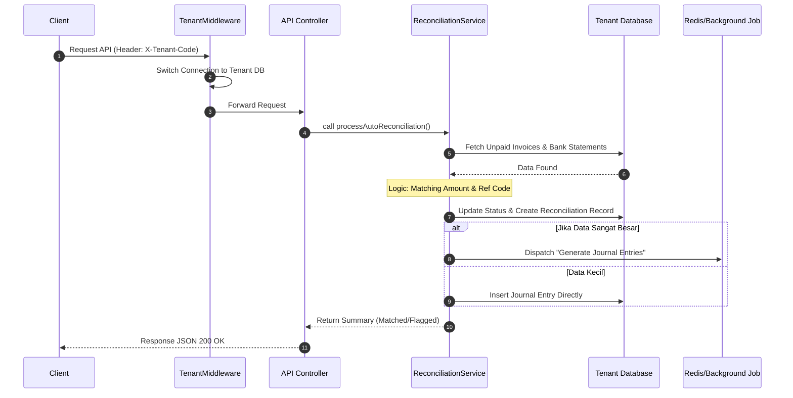
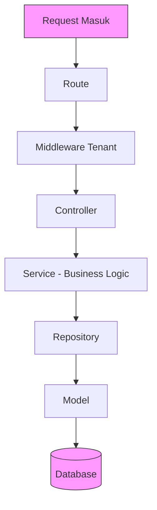

# Dokumentasi Arsitektur API & Rekonsiliasi

Dokumen ini mendefinisikan standar komunikasi antar komponen dan pola desain kode agar logika bisnis tetap bersih, modular, dan mudah diuji.

---

## 1. Sequence Diagram: Proses Rekonsiliasi (Sistem Multi-DB)

Diagram ini menggambarkan bagaimana sebuah request rekonsiliasi diproses dari mulai identifikasi tenant hingga eksekusi asinkron.

## 2. Arsitektur Layering: Pemisahan Tanggung Jawab

Pemisahan kode ke dalam beberapa layer bertujuan untuk mencapai *Separation of Concerns*. Hal ini memastikan bahwa perubahan di satu bagian (misalnya perubahan database) tidak akan merusak bagian lain (seperti logika bisnis). Ini adalah standar profesional untuk membangun sistem yang mudah dipelihara (*maintainable*) dan diuji (*testable*).

### Mengapa Layer ini Ada?

| Layer | Tanggung Jawab | Manfaat |
|-------|----------------|---------|
| **Route & Middleware** | Filter pertama, memastikan request masuk ke koneksi database tenant yang benar | Keamanan & isolasi data antar perusahaan |
| **Controller** | Pengatur lalu lintas, meneruskan request ke service yang tepat | Memisahkan logika HTTP dari bisnis logic |
| **Service** | Jantung aplikasi, berisi semua aturan bisnis ERP | Mudah diuji, logic terpusat |
| **Repository (Opsional)** | Mengisolasi query database | Fleksibel terhadap perubahan database |
| **Model** | Representasi data dan interaksi dengan database | Konsistensi struktur data |

### Alur Data Antar Layer

### Prinsip yang Harus Dipegang

1. **Controller tidak boleh berisi logic bisnis** - hanya memanggil service
2. **Service tidak boleh tahu tentang HTTP request/response** - hanya menerima data
3. **Repository tidak boleh berisi logic bisnis** - hanya query database
4. **Model hanya untuk representasi data** - tidak boleh berisi logic bisnis kompleks
5. **Setiap layer hanya bicara dengan layer di bawahnya** - jangan lompat-lompat
