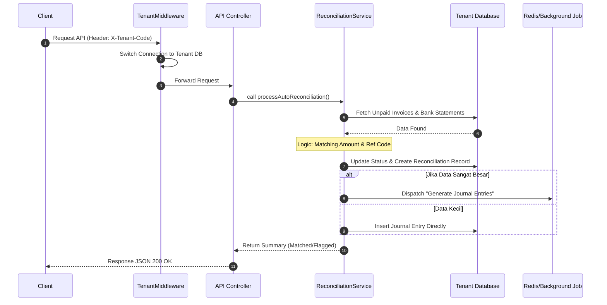
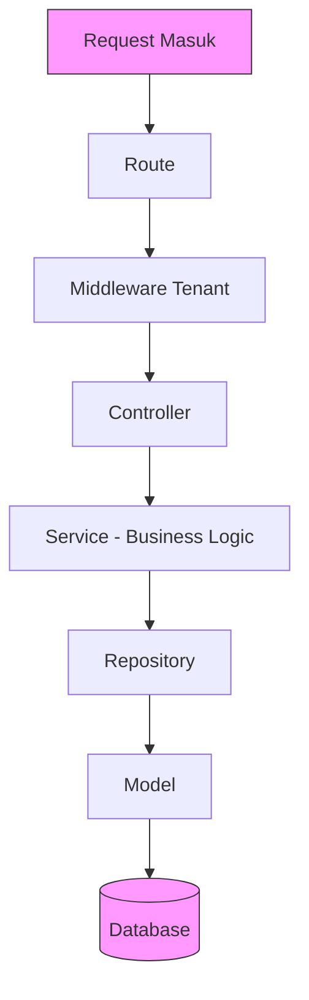

# Dokumentasi Arsitektur API & Rekonsiliasi

Dokumen ini mendefinisikan standar komunikasi antar komponen dan pola desain kode agar logika bisnis tetap bersih, modular, dan mudah diuji.

---

## 1. Sequence Diagram: Proses Rekonsiliasi (Sistem Multi-DB)

Diagram ini menggambarkan bagaimana sebuah request rekonsiliasi diproses dari mulai identifikasi tenant hingga eksekusi asinkron.



## 2. Arsitektur Layering: Pemisahan Tanggung Jawab

Pemisahan kode ke dalam beberapa layer bertujuan untuk mencapai *Separation of Concerns*. Hal ini memastikan bahwa perubahan di satu bagian (misalnya perubahan database) tidak akan merusak bagian lain (seperti logika bisnis). Ini adalah standar profesional untuk membangun sistem yang mudah dipelihara (*maintainable*) dan diuji (*testable*).

### Mengapa Layer ini Ada?

| Layer | Tanggung Jawab | Manfaat |
|-------|----------------|---------|
| **Route & Middleware** | Filter pertama, memastikan request masuk ke koneksi database tenant yang benar | Keamanan & isolasi data antar perusahaan |
| **Controller** | Pengatur lalu lintas, meneruskan request ke service yang tepat | Memisahkan logika HTTP dari bisnis logic |
| **Service** | Jantung aplikasi, berisi semua aturan bisnis ERP | Mudah diuji, logic terpusat |
| **Repository (Opsional)** | Mengisolasi query database | Fleksibel terhadap perubahan database |
| **Model** | Representasi data dan interaksi dengan database | Konsistensi struktur data |

### Alur Data Antar Layer



### Prinsip yang Harus Dipegang

1. **Controller tidak boleh berisi logic bisnis** - hanya memanggil service
2. **Service tidak boleh tahu tentang HTTP request/response** - hanya menerima data
3. **Repository tidak boleh berisi logic bisnis** - hanya query database
4. **Model hanya untuk representasi data** - tidak boleh berisi logic bisnis kompleks
5. **Setiap layer hanya bicara dengan layer di bawahnya** - jangan lompat-lompat

```markdown
## 3. Contoh Implementasi Kode (Laravel)

### A. Model Layer (Data Contract & Type Safety)

Model digunakan untuk mendefinisikan struktur data dan interaksi dengan database. Kita juga bisa menggunakan Form Request untuk validasi.

**app/Models/Invoice.php**
```php
<?php

namespace App\Models;

use Illuminate\Database\Eloquent\Model;

class Invoice extends Model
{
    protected $table = 'invoices';

    protected $fillable = ['invoice_number', 'total_amount', 'status'];

    protected $casts = [
        'total_amount' => 'decimal:2',
    ];
}
```

**app/Http/Requests/ReconciliationRequest.php**
```php
<?php

namespace App\Http\Requests;

use Illuminate\Foundation\Http\FormRequest;

class ReconciliationRequest extends FormRequest
{
    public function authorize(): bool
    {
        return true;
    }

    public function rules(): array
    {
        return [
            'amount' => 'required|numeric|min:0.01',
            'refCode' => 'required|string|max:50',
            'bankId' => 'required|string|max:50',
        ];
    }

    public function messages(): array
    {
        return [
            'amount.min' => 'Nominal harus positif',
        ];
    }
}
```

**app/DTO/ApiResponse.php**
```php
<?php

namespace App\DTO;

class ApiResponse
{
    public string $status;
    public $data;
    public string $message;

    public function __construct(string $status, $data = null, string $message = "")
    {
        $this->status = $status;
        $this->data = $data;
        $this->message = $message;
    }

    public function toArray(): array
    {
        return [
            'status' => $this->status,
            'data' => $this->data,
            'message' => $this->message,
        ];
    }
}
```

### B. Route & Middleware Layer (Tenant Switcher)

**routes/api.php**
```php
<?php

use Illuminate\Support\Facades\Route;
use App\Http\Controllers\ReconciliationController;

Route::post('/reconcile', [ReconciliationController::class, 'process'])
    ->middleware('tenant.database');
```

**app/Http/Middleware/TenantDatabaseMiddleware.php**
```php
<?php

namespace App\Http\Middleware;

use Closure;
use Illuminate\Http\Request;
use App\Services\TenantManager;
use Symfony\Component\HttpFoundation\Response;

class TenantDatabaseMiddleware
{
    public function __construct(protected TenantManager $tenantManager) {}

    public function handle(Request $request, Closure $next): Response
    {
        $tenantCode = $request->header('X-Tenant-Code');

        if (!$tenantCode) {
            return response()->json(['error' => 'Kode tenant tidak ditemukan'], 400);
        }

        try {
            $this->tenantManager->setConnection($tenantCode);
        } catch (\Exception $e) {
            return response()->json(['error' => 'Koneksi database tenant gagal: ' . $e->getMessage()], 500);
        }

        return $next($request);
    }
}
```

### C. Controller Layer (The Orchestrator)

**app/Http/Controllers/ReconciliationController.php**
```php
<?php

namespace App\Http\Controllers;

use App\Http\Requests\ReconciliationRequest;
use App\Services\ReconciliationService;
use App\DTO\ApiResponse;
use Exception;

class ReconciliationController extends Controller
{
    public function __construct(protected ReconciliationService $reconciliationService) {}

    public function process(ReconciliationRequest $request)
    {
        try {
            $validatedData = $request->validated();
            $result = $this->reconciliationService->handle($validatedData);
            return response()->json(new ApiResponse("success", $result));
        } catch (Exception $e) {
            return response()->json(new ApiResponse("error", null, $e->getMessage()), 400);
        }
    }
}
```

### D. Service Layer (Business Logic)

**app/Services/ReconciliationService.php**
```php
<?php

namespace App\Services;

use App\Repositories\InvoiceRepository;
use Exception;

class ReconciliationService
{
    public function __construct(protected InvoiceRepository $invoiceRepo) {}

    public function handle(array $data): array
    {
        $invoice = $this->invoiceRepo->findByReference($data['refCode']);

        if (!$invoice) {
            throw new Exception("Referensi tidak ditemukan");
        }

        if ((float) $invoice->total_amount !== (float) $data['amount']) {
            throw new Exception("Nominal tidak cocok");
        }

        $reconciliation = $this->invoiceRepo->markAsPaid($invoice->id, $data['bankId']);

        return [
            'invoice_id' => $invoice->id,
            'status' => 'matched',
            'reconciliation_id' => $reconciliation->id,
        ];
    }
}
```

### E. Repository Layer (Data Access)

*Catatan: Repository Layer ini opsional. Anda bisa langsung menggunakan Model Laravel.*

**app/Repositories/InvoiceRepository.php**
```php
<?php

namespace App\Repositories;

use App\Models\Invoice;
use App\Models\Reconciliation;
use Illuminate\Support\Facades\DB;

class InvoiceRepository
{
    public function findByReference(string $ref): ?Invoice
    {
        return Invoice::where('invoice_number', $ref)->first();
    }

    public function markAsPaid(string $invoiceId, string $bankId): Reconciliation
    {
        return DB::transaction(function () use ($invoiceId, $bankId) {
            $invoice = Invoice::findOrFail($invoiceId);
            $invoice->update(['status' => 'PAID']);

            return Reconciliation::create([
                'invoice_id' => $invoice->id,
                'bank_id' => $bankId,
                'reconciled_at' => now(),
            ]);
        });
    }
}
```
