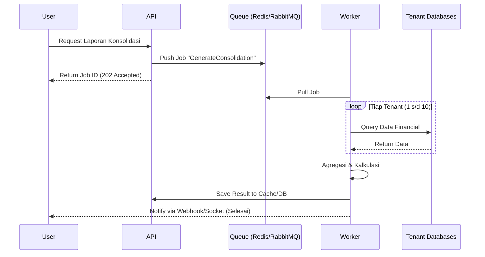

# Strategi Caching & Background Processing

Dokumen ini menjelaskan bagaimana sistem menangani komputasi berat, terutama untuk **Laporan Konsolidasi** dan **Rekonsiliasi Payment** otomatis, agar performa API tetap responsif.

## 1. Background Processing (Queue Strategy)

Proses yang memakan waktu lebih dari 2 detik (seperti mengumpulkan data dari 10 database) tidak boleh dijalankan langsung di Controller.

### Alur Kerja Asinkron

1. **Job Dispatcher**: Saat user meminta laporan konsolidasi, API tidak langsung menghitungnya. API hanya memasukkan "tugas" ke dalam antrian (Queue) dan memberikan respon `202 Accepted` dengan `job_id`.
2. **Worker Nodes**: Worker yang berjalan di latar belakang akan mengambil tugas tersebut, melakukan koneksi ke setiap database tenant secara bergantian, dan melakukan agregasi data.
3. **Notification/Polling**: Setelah selesai, Worker menyimpan hasilnya ke database sementara atau cache, lalu memberi tahu user melalui WebSocket atau mekanisme *polling*.

---

## 2. Caching Strategy (Performance Optimization)

Kita menggunakan **Redis** sebagai layer penyimpanan sementara untuk menghindari query berulang ke database tenant yang mahal.

### A. Distributed Cache (Shared Results)

Hasil laporan konsolidasi yang sudah dihitung oleh Worker disimpan di Redis dengan TTL (*Time To Live*), misalnya 1 jam. Jika user lain (dari holding) meminta laporan yang sama, sistem langsung mengambil dari Redis.

### B. Cache Invalidation (On-Demand)

Karena ini adalah sistem ERP, akurasi data sangat penting. Kita menerapkan strategi **Write-Through** atau **Manual Invalidation**:

* Jika terjadi rekonsiliasi payment baru di salah satu anak perusahaan, sistem akan menghapus (clear) cache laporan konsolidasi yang berkaitan agar saat ditarik kembali, sistem melakukan kalkulasi ulang yang akurat.

---

## 3. Implementasi

Standar berikut wajib dipatuhi:

### I. Skalabilitas Worker

Worker harus bersifat *stateless*. Jika laporan konsolidasi sangat banyak, kita harus bisa menambah jumlah Worker (*Horizontal Scaling*) tanpa mengubah kode program.

### II. Dead Letter Queue (DLQ)

Jika Worker gagal memproses rekonsiliasi karena salah satu database tenant *down*, tugas tersebut tidak boleh hilang.

* Pindahkan tugas gagal ke **DLQ**.
* Sistem akan mencoba ulang (*Retry Mechanism*) sebanyak 3 kali sebelum memberikan notifikasi kegagalan kepada Lead Dev.

### III. Data Chunking

Saat menarik data besar dari 10 database, jangan memuat semua data ke memori sekaligus (RAM). Gunakan teknik **Chunking** atau **Streaming** agar server tidak mengalami *Out of Memory* (OOM).

---

## 4. Kesimpulan Strategi

| Fitur | Strategi | Tools Rekomendasi |
| --- | --- | --- |
| **Laporan Konsolidasi** | Background Job + Caching | Redis, Sidekiq/BullMQ/Go-workers |
| **Rekonsiliasi Otomatis** | Queue | RabbitMQ / Redis Streams |
| **Penyimpanan Laporan** | Materialized View / Cache Table | Redis / PostgreSQL JSONB |

---
