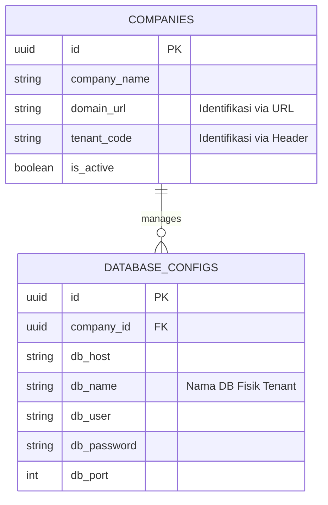
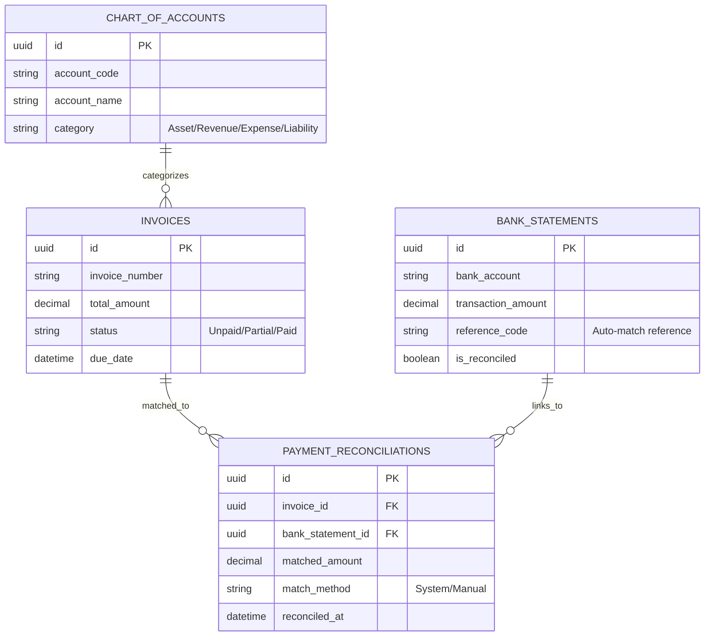

# Dokumentasi Skema Database ERP (Multi-Company)

Dokumen ini menjelaskan struktur data untuk mendukung fitur **Multi-tenancy** menggunakan strategi *Database-per-Tenant*, Rekonsiliasi Payment, dan Laporan Konsolidasi.

---

## 1. Main Database (Control Plane)
Database ini berfungsi sebagai pusat kendali untuk mengidentifikasi dan mengarahkan koneksi ke database anak perusahaan yang tepat.

## 2. Tenant Database (Data Plane)
Database ini diduplikasi untuk setiap anak perusahaan. Tidak terdapat kolom company_id karena data sudah terisolasi secara fisik di level database.

## 3. Panduan Implementasi untuk Backend Developer

Kepada tim Backend, mohon perhatikan logika berikut agar implementasi sesuai dengan standar arsitektur:

### A. Mekanisme Dynamic Connection
Aplikasi tidak boleh menggunakan koneksi statis. Setiap request harus melalui middleware untuk menentukan database target sebelum logika bisnis dijalankan:

1. **Identifikasi**: Ambil identitas perusahaan melalui **Subdomain (URL)** (misal: `anak-a.erp.com`) atau **Custom Header** (`X-Tenant-Code`).
2. **Lookup**: Lakukan query ke **Main Database** pada tabel `COMPANIES` dan `DATABASE_CONFIGS` menggunakan identitas yang didapat.
3. **Switch**: Gunakan konfigurasi (host, db_name, username, password) tersebut untuk mengubah koneksi database *default* aplikasi secara dinamis (on-the-fly).

### B. Migrasi Database
Untuk menjaga integritas skema di seluruh lingkungan, tim harus membedakan proses migrasi:

* **Main Migration**: Gunakan perintah migrasi standar (misal: `php artisan migrate` atau `npx prisma migrate`) yang hanya ditujukan untuk tabel di **Main Database**.
* **Tenant Migration**: Gunakan perintah kustom yang melakukan *looping* ke semua database yang terdaftar di `DATABASE_CONFIGS`. Perintah ini memastikan skema di setiap database anak perusahaan tetap sinkron (homogen).

### C. Strategi Konsolidasi Laporan
Karena data terpisah secara fisik, penarikan laporan konsolidasi dilakukan dengan:
1. Iterasi query ke masing-masing database tenant yang aktif.
2. Melakukan agregasi data (Collection/Array Map) di level aplikasi.
3. Gunakan **Caching** jika data yang ditarik melibatkan kalkulasi berat dari 10 anak perusahaan sekaligus.
